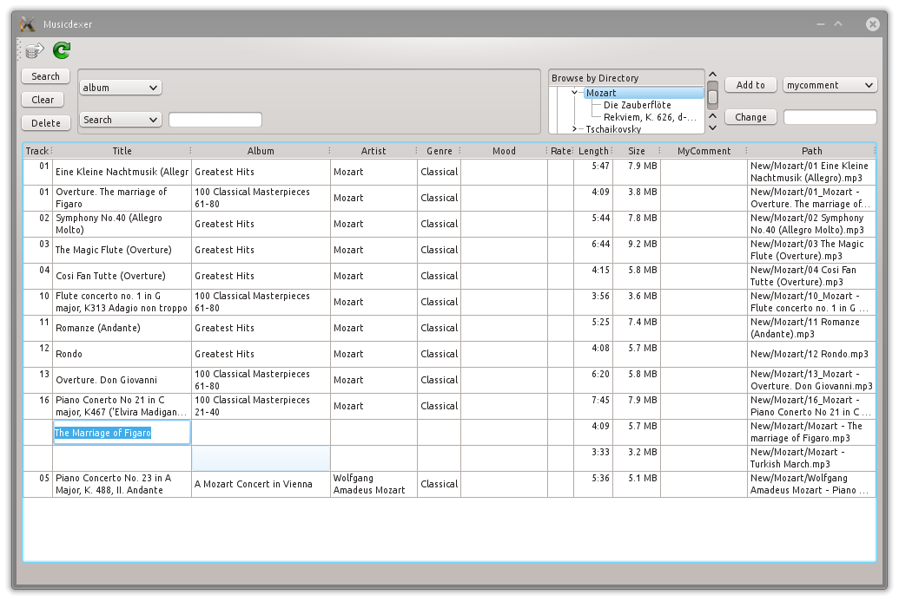

Musicdexer
==========

Musicdexer is a music collection database program allows you to add your own moods to songs. You can then search for songs by mood or any other category. Musicdexer features intelligent sync, automatic mp3 tag editing, quick advanced searches, and editing multiple songs at once.

==========
#### Usage Example: ####

Musicdexer allows you to add your own personal rating and moods to songs. You can then use those categories, and others, to search for songs in your collection. Think of the mood category as a far more detailed version of genre. For example, you can label specific songs in your collection as 'creepy', and then search for all 'creepy' songs when you want to make a playlist for a Halloween party. Like-wise, find tropical music for a day at the beach.

**Sync:**
With a music directory selected, you can click the sync button and it will decide what files to add to the database, or what changes to make. If you move files around in the folder, it will update the paths in the database. If you change some data in the files it will update the database. If you put new files in the folder, it will add them to the collection.

**Search:**
You can choose what to search by by using a drop down menu which defaults to album. The default search type(Search) will look for your entered text in any part of an album name, but there are several other search types available as well. If you wanted to look for all songs under about 5mb, you would change the first drop-down menu to 'size' and then the second drop down menu to '<', then enter 5000000 into the box next to it and press enter or click Search. You can also display songs in each folder by double click on on the particular folder in the 'Browse by Folder' area.

**Edit:**
You can double-click on items in your collection to edit them. You can also edit all items in the current display(search results) at once. So if you want to change a spelling error in an album name, you would first search for the misspelled album. Depending on how you search, you might want to ensure only the songs in that album are listed. Then at the top right, change the drop-down(defaults to mood) to album. Type the proper name for the album in the text area below and click change. If you had clicked 'Add to' instead, it would have put the correct album name in front of the old one. 'Add to' is useful for adding additional artists or moods to multiple songs.
If you remove some music from your music directory, a record of it will be kept in the database. This is useful if you don't always keep all of your music in your music folder. So if/when you add it back in later, your personal settings for it will remain. If you wish, you can also delete songs that are missing. Their paths show up red in the database. **NOTE:** Changes made are implemented immediately and there is currently no undo feature. Musicdexer will not try to delete any music files, but it will automatically write tag data.

**Columns:**
The Track, Title, Album, Artist, and Genre fields are connected to the songs mp3 data. So updating one or more of these will also update the tag data. The Mood, Rating, and Comment fields are stored in your collection's database only. The other fields are available to help with searching and identifying and cannot be edited.

==========

